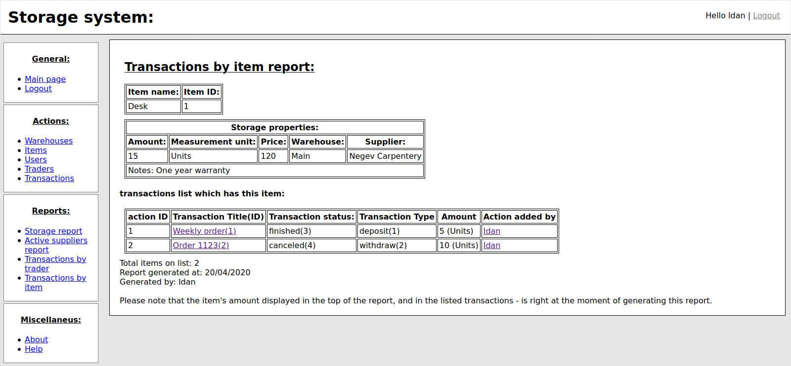
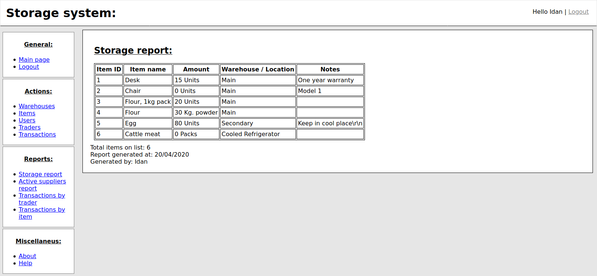
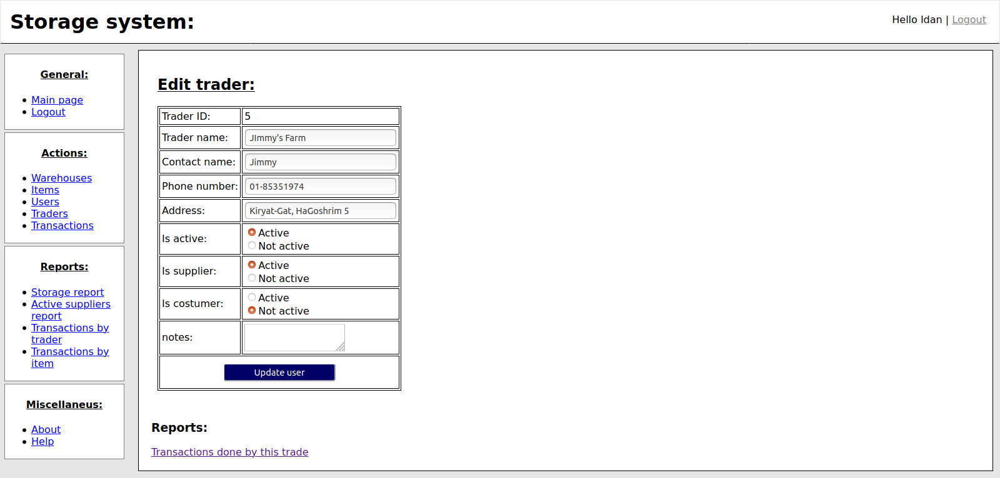
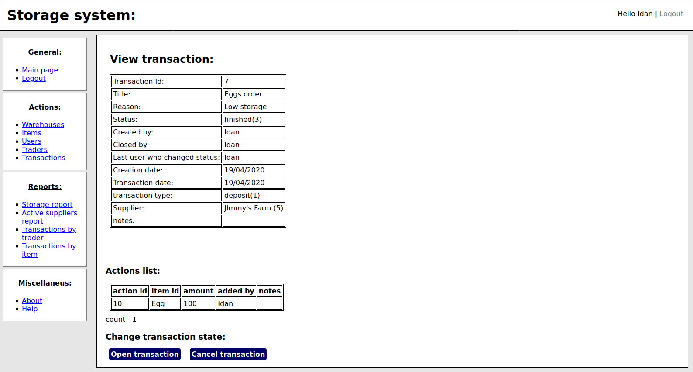
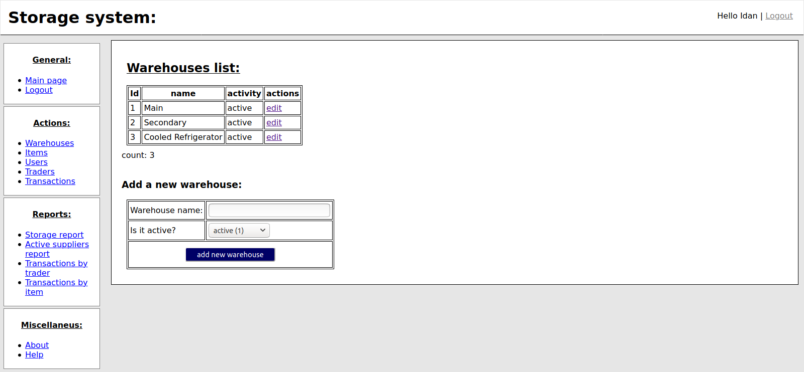

# Storage System - 
The Storage System is a python application created with python3 using Flask. This application is made for use managing storage of small businesses and organization. The system can manage deposits and withdraws, track down storage and track users' actions. 
## The system includes - 
*Multiple users environment, which tracks their actions on storage amounts. 
*Organize the items according to location ( warehouse where they reside) and supplier. 
*Make reports showing current storage, items movements, and traders orders. (suppliers and costumers)
*Manage multiple traders, suppliers or costumer, giving the abillity to track their items movement. 

This is my first python project. It uses Flask (with Jinja2) , python, HTML, CSS and more technologies. The data is stored in SQLite database. 


### Short "how to" instructions of running the application - 
The main application file's name is ```main.py``` . Run it from the virtual environement to start the application. 


## Images gallery - 
 
 
 
 
 


## Docker version - 
I have made dockerized versions of this application, based on Ubuntu 18.04 or Alpine Linux. 
To build the image, download the repository and run the following command while in the directory itself - 
```bash
docker build -t storage . #Will use the default Dockerfile which uses Alpine Linux. 
docker build -t storage -f Dockerfile_ubuntu18.04 . #Will use the specified Dockerfile which uses Ubuntu 18.04 Linux. 
```
This will build the image and tag it under the tag name "storage:latest" . ( Of course you can change it. ) 
PLEASE NOTE - The installation of the application requires admin username, display name and password. These are set in the dockerfile itself! So change them before building the image. 

To run the image - 
```bash
docker run -p 5000:5000 storage
docker run -d -p 5000:5000 storage #Detached mode, meaning that the docker container will run at the background, without outputing to the terminal. 
```

Note - When build the up, docker will run the ```setup.py``` script which creates sets up the SQLite database and will setup the admin user. You can choose different username and password for the admin by editing the ```Dockerfile``` or by loging in to the application and changing the admin username and password, under users menu. 

### Mounting (Keeping) your data - ###
In order to save your data, which includes the database file - you need to mount the file. This can be done while spinning up the docker container. In the following command the database directory will be save to a docker volume named db. When wishing to reload the data again, run the same docker command - this will put in the db file the database file from the former docker container instance. 
```bash
docker run -d -p 5000:5000 -v db:/app/db storage
```


## How to install it on your local machine - 
Here are the instructions on how to install and operate the project from your own machine. The instructions are for Linux distributions, though with fine guides from the web you can operate it from Windows too. Also, it is assumed you have python3 installed on your machine. 
1. Download the repository. 
2. Copy the application files to the desired location. 
3. Make sure pip is installed in your machine. ( ```sudo apt install python3-pip``` for Ubuntu. ) 
4. Install virtual environment in this directory - 
```bash
python3 -m venv envname
```

5. Active the virtual environment - 
```bash 
source env/bin/activate
```
5. Install the packages used for this **Storage System** application. 
```bash
pip install -r requirements.txt #Make sure you have activated the virtual environment (venv) and in the applications directory. 
```
6. Before starting the application, you need to set the database and admin user. You can do this by executing the file ```setup.py``` . Note that you have to do it only once when first installing the application! 
	* You can setup the application in two ways - 
	* By running the command ```python3 setup.py``` and putting the admin user credentials manually. 
	* Or by using system arguments in the command-line itself - ```python3 setup.py username display_name password``` . For example ```python3 setup.py admin Idan 1234``` will setup the application wiht a user admin named "admin" with password "1234" and its display name will be "Idan" . This method is useful for automatic installation scripts such as when creating Dockerfile or using Ansible. 
7. Finally - launch the application - 
```bash
python3 main.py
```

If everything worked - an output like this should be printed - 
```bash
$ python3 main.py 
 * Serving Flask app "main" (lazy loading)
 * Environment: production
   WARNING: This is a development server. Do not use it in a production deployment.
   Use a production WSGI server instead.
 * Debug mode: on
 * Running on http://127.0.0.1:5000/ (Press CTRL+C to quit)
 * Restarting with stat
 * Debugger is active!
 * Debugger PIN: 141-652-837
```

Now you can enter to the specified address and start using the application! 


### Backing up the database - 
All data used by the application is saved in an SQLIte database file, named ```storage_db.db``` . If you wish to use the data in another machine, just copy this file to the application directory. ( And skip the setup process. ) 
